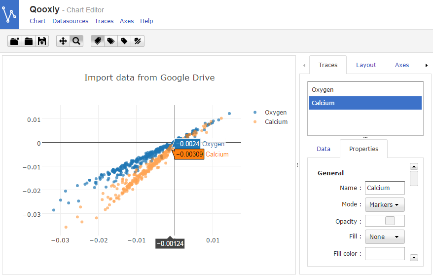

# qxPlotly

qxPlotly is a [Qooxdoo](http://qooxdoo.org/) wrapper for [Plotly](https://plot.ly/javascript/)



## 1. Add the qxPlolty contrib to your project

* Download qxPlotly
* Paste it in your project (e.g. within the top-level directory `contribs`)
* Add the following in your config.json file

```json
"jobs" : {
  "libraries" : {
    "library" : [{
      "manifest": "contribs/qxplotly/Manifest.json"
      }
    ]
  }
  ...
}
```

More infos at http://manual.qooxdoo.org/devel/pages/development/contrib.html


## 2. Start using qxPlotly

Create a new chart:

```javascript
var qxchart = new ae.plotly.ui.Chart()
```

Because Plotly needs a DOM element, after the qxchart creation, 2 methods are possible to plot a chart :
* add the chart widget to the application root or any other widget which is attached to the root, flush and then plot the chart using `chart.plot(data,layout)`;
* use the `appear` event with the `addListnerOnce` method. Be careful to call the `addListenerOnce("appear",...)` method before the chart widget apparition otherwise it won't be triggered (e.g. on a successfull response of an ajax call)
 
**Method 1**
```javascript
this.getRoot().add(qxchart,{edge:0});
qx.ui.core.queue.Manager.flush();		
chart.plot(data,layout);
```

**Method 2**
```javascript
qxchart.addListenerOnce("appear",function(e){
	qxchart.plot(data,layout);
});
```

Once the plotly chart is created, you can use the following methods whic are equivalent to the [Plotly functions](https://plot.ly/javascript/plotlyjs-function-reference/) :
* addTraces(Object traces, Array indices)
* deleteTraces(Array indices)
* moveTraces(Array currentindices, Array newindices)
* redraw()
* restyle(Object update, Array traces)
* relayout(Object update)
* plot(Object data, Object layout) (equivalent to newPlot function in Plolty)

but also :
* exportTo(String format) : available format are ‘jpeg’ | ‘png’ | ‘json’ | ‘svg’
* getSettingsUI() : returns the editor (`qx.ui.container.Composite`)
