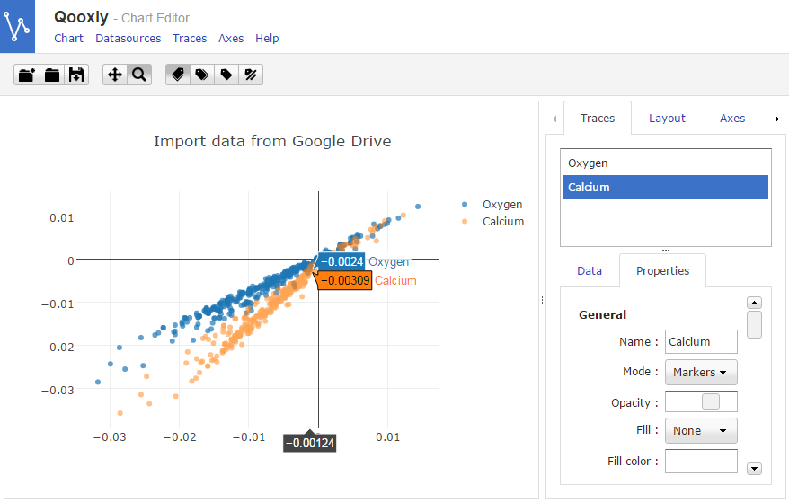

# Qooxly

Qooxly is a chart editor based on [qxCHART](https://github.com/adeliz/qxchart) (a [Qooxdoo](http://qooxdoo.org/) wrapper for [Plotly](https://plot.ly/javascript/))

A demo is available at https://rawgit.com/adeliz/qooxly/master/build/index.html

Examples :
* [Google drive](https://rawgit.com/adeliz/qooxly/master/build/index.html?url=https://gist.githubusercontent.com/adeliz/e0f01adf89b8ea75b15df8629c125c3c/raw/ceb1349bd982c651c26aaade068fb7daf031dff6/gdrive.json)
* [NYC Open data](https://rawgit.com/adeliz/qooxly/master/build/index.html?url=https://gist.githubusercontent.com/adeliz/e0f01adf89b8ea75b15df8629c125c3c/raw/nyc_opendata.json)

